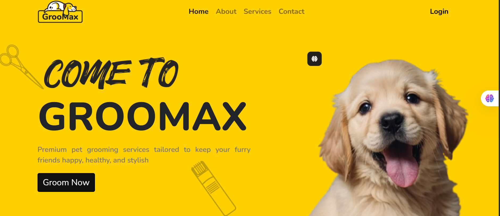

# 🐾 Groomax – Pet Grooming Web Application

Groomax is an interactive **pet grooming web application** developed as part of my **Full Stack Development Internship (ISHIP)** at **Technical Hub**.  
This project includes a beautiful landing page and a full **appointment booking form** for pet grooming, built with clean UI design and smooth JavaScript interactions.

---

## 🚀 Live Demo

👉 **Deployed Link:** https://pet-groo-ming.vercel.app/

---

## 📸 Screenshots


### 🏠 Landing Page  



---

## ✨ Features

### 🏠 **Responsive Landing Page**
- Attractive pet grooming theme  
- Service highlights and features  
- Clean, modern UI  
- Fully responsive across devices  

### 📅 **Pet Grooming Appointment Form**
- Users can enter:
  - Pet Name  
  - Pet Type / Breed  
  - Owner Name  
  - Contact Number  
  - Appointment Date  
  - Grooming Service Type  
- JavaScript validation for error-free input  
- Data can be stored using **Local Storage** or connected to **MySQL**  
- Shows instant confirmation after booking  

### 🧾 **Dynamic Display (optional)**
- Display booked appointments using DOM manipulation  
- Allows users to visually see what they submitted  

### 🎨 **Smooth User Experience**
- Hover effects  
- Animations  
- Clean layout and color consistency  

---

## 🛠️ Tech Stack

### **Frontend**
- HTML  
- CSS  
- JavaScript  

### **Backend (Optional for MySQL integration)**
- JavaScript  
- PHP / Node.js *(only if used on your side)*  

### **Database (Optional)**
- MySQL *(If you store appointment data in DB)*

### **Tools**
- Visual Studio Code  
- GitHub  
- Canva / Figma (UI design)  
- Vercel (Deployment)

---

## 📂 Project Structure

Groomax/
│── index.html # Landing Page
│── appointment.html # Booking Form Page
│── style.css # Stylesheet
│── script.js # JS for landing page
│── appointment.js # JS for booking form validation
│── assets/
│ ├── landing-page.png
│ └── appointment-form.png
└── README.md


---

## 🔧 How to Run the Project Locally

### 1️⃣ Clone the repository  
```bash
git clone https://github.com/yourusername/groomax.git
```
### 2️⃣ Open the folder in VS Code
cd groomax

### 3️⃣ Run the project

Just open the index.html file in your browser.

### 4️⃣ (Optional) Connect MySQL

Import your groomax.sql file

Update your backend script to insert form data

### 🙌 Acknowledgements

Special thanks to:

Technical Hub

ISHIP Internship Program

Hanumanthu Buddha

My teammates for support

### ⭐ Future Enhancements

Full admin dashboard

Appointment approval system

Image upload for pets

WhatsApp/SMS booking notifications

Payment integration
